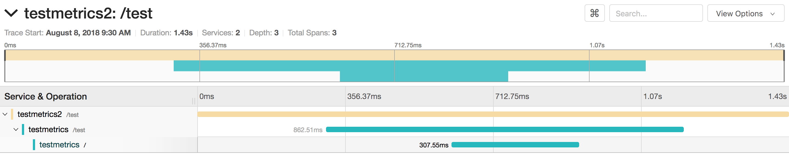

---

copyright:
  years: 2018, 2019
lastupdated: "2019-06-12"

keywords: how to trace go apps, tracing go, jaeger go, opentracing go, jaeger packages, debug go app, troubleshoot go, go app help

subcollection: go

---

{:new_window: target="_blank"}
{:shortdesc: .shortdesc}
{:screen: .screen}
{:codeblock: .codeblock}
{:pre: .pre}
{:tip: .tip}

# Tracing in Go-Apps einrichten
{: #go-e2e-tracing}

Das folgende Lernprogramm konzentriert sich auf OpenTracing- und Jaeger-Pakete für das Tracing von Go-Anwendungen. Weitere Informationen zur Verwendung von Jaeger finden Sie im [Jaeger-Dokumentationsportal](https://www.jaegertracing.io/docs/1.11/){: new_window} .

In den folgenden Schritten werden zwei kleine Anwendungen (eine Front-End-Anwendung, eine Back-End-Anwendung) für das Tracing zwischen zwei Endpunkten mithilfe des Jaeger-Moduls verwendet. Dabei können Sie bei Null anfangen oder aber die hier beschriebenen Prinzipien auf Ihre vorhandenen Go-Anwendungen anwenden.

## Schritt 1. OpenTracing- und Jaeger-Pakete installieren und aktivieren
{: #install-go-opentracing}

1. Fügen Sie die erforderlichen Pakete in Ihre Abhängigkeitsliste ein. Geben Sie dazu die folgenden Befehle an derselben Position ein, an der sich die Datei `Gopkg.toml` Ihrer Go-Anwendung befindet:
  ```go
  dep ensure -add "github.com/opentracing/opentracing-go"
  dep ensure -add "github.com/uber/jaeger-client-go"
  dep ensure -add "github.com/uber/jaeger-lib/metrics/prometheus"
  ```
  {: codeblock}

2. Fügen Sie die folgenden Zeilen zu Ihrem Go-Server-Code hinzu:
  ```go
  import(
  "github.com/opentracing/opentracing-go"
	"github.com/opentracing/opentracing-go/ext"
	"github.com/uber/jaeger-client-go"
	jaegerprom "github.com/uber/jaeger-lib/metrics/prometheus"
  )
  ```
  {: codeblock}

### Tracing zur Serveranwendung hinzufügen
{: #add-tracing-go}

Es sind einige Anweisungen notwendig, um Tracing zu Ihrer Serveranwendung hinzuzufügen. Als Erstes müssen Sie einen Tracer erstellen.

Geben Sie zum Erstellen eines Tracers die folgenden Elemente an: 
 * Transporter
 * Reporter
 * Optionale Exportkomponente für Metriken
 
In diesem Lernprogramm exportiert Jaeger Metriken im Stil von Prometheus. Ein Metrikobjekt ermöglicht Jaeger, Metriken an Prometheus zu melden.

1. Fügen Sie zum Erstellen eines Metrikobjekts die folgenden Anweisungen zu der Hauptfunktion hinzu:
  ```go
  factory := jaegerprom.New()
  metrics := jaeger.NewMetrics(factory, map[string]string{"lib": "jaeger"})
  ```
  {: codeblock}

2. Geben Sie die folgende Anweisung für einen Transporter an, mit der Jaeger mitgeteilt wird, wohin die erstellten Traces gesendet werden sollen. Bei lokaler Entwicklung ist `localhost` an Port `5775` das Ziel. Während der Hostname abweichen kann, wird in meisten Fällen `5775` als Port verwendet.
  ```go
  transport, err := jaeger.NewUDPTransport("<hostname>:<port>", 0)
  if err != nil {
	log.Errorln(err.Error())
  }
  ```
  {: codeblock}

3. Ein Reporter teilt Jaeger mit, wie seine Tracedaten gemeldet werden. Es werden drei Reportertypen verwendet:
  * Protokollierung - Druckt Span-Daten als Protokoll
  * Fern - Sendet Span-Daten an einen Jaeger-Agenten
  * Verbund - Kombiniert mehrere Reporter

  Da Go-Starter-Kits Logrus für die Protokollierung von Daten verwenden, ist die Meldung von Jaeger-Spans nicht standardmäßig möglich. Jaeger unterstützt jedoch eine Protokollierungsschnittstelle, deren Verwendung nach dem Hinzufügen eines Protokollierungsadapters mit der folgenden Anweisung möglich ist:
  ```go
  type LogrusAdapter struct{}

  func (l LogrusAdapter) Error(msg string) {
	log.Errorf(msg)
  }

  func (l LogrusAdapter) Infof(msg string, args ...interface{}) {
	log.Infof(msg, args)
  }
  ```
  {: codeblock}

4. Wenn Sie einen Reporter erstellen wollen, der Spans sowohl protokolliert als auch meldet, fügen Sie die folgenden Anweisungen hinzu:
  ```go
  logAdapt := LogrusAdapter{}
  reporter := jaeger.NewCompositeReporter(
	jaeger.NewLoggingReporter(logAdapt),
	jaeger.NewRemoteReporter(transport,
		jaeger.ReporterOptions.Metrics(metrics),
		jaeger.ReporterOptions.Logger(logAdapt),
	),
  )
  defer reporter.Close()
  ```
  {: codeblock}

5. Ein Samplerobjekt für Stichproben bestimmt, in welchen Situationen und wann Spans gemeldet werden. Zu Entwicklungszwecken meldet eine Anwendung die Daten für alle Spans, die sie erhält. Im Produktionsbetrieb ist es unter Umständen jedoch nicht möglich, alle Spans zu melden. Wenn alle Spans gemeldet werden sollen, können Sie hierzu das Objekt 'ConstSampler' verwenden:
  ```go
  sampler := jaeger.NewConstSampler(true)
  ```
  {: codeblock}

6. Nachdem Sie nun die Objekte 'reporter', 'sampler' und 'metrics' erstellt haben, können Sie einen Tracer erstellen.
  ```go
  tracer, closer := jaeger.NewTracer("<application name>",
	sampler,
	reporter,
	jaeger.TracerOptions.Metrics(metrics),
  )
  defer closer.Close()

  opentracing.SetGlobalTracer(tracer)
  ```
  {: codeblock}

7. Fügen Sie eine Middlewarefunktion hinzu, die entweder Span-Daten aus einer Clientanforderung extrahiert oder ein neues Stammobjekt für Span-Elemente erstellt:
  ```go
  func OpenTracing() gin.HandlerFunc {
	return func(c *gin.Context) {
		wireCtx, _ := opentracing.GlobalTracer().Extract(
			opentracing.HTTPHeaders,
			opentracing.HTTPHeadersCarrier(c.Request.Header))

		serverSpan := opentracing.StartSpan(c.Request.URL.Path,
			ext.RPCServerOption(wireCtx))
		defer serverSpan.Finish()
		c.Request = c.Request.WithContext(opentracing.ContextWithSpan(c.Request.Context(), serverSpan))
		c.Next()
	}
  }
  ```
  {: codeblock}

8. Fügen Sie die Middleware zum Router hinzu. Beachten Sie, dass Sie diese Anweisung VOR der Erstellung der Endpunkte hinzufügen **MÜSSEN**:
  ```go
  router.Use(OpenTracing)
  ...
  router.GET("/health", routes.HealthGET)
  ```
  {: codeblock}

  Diese Anweisung richtet eine Anwendung ein, die ein Span-Element extrahieren und dann neue Span-Daten melden kann. Standardmäßig implementieren alle Go-Starter-Kits die serverseitige OpenTracing-Version vollständig.

9. Damit die Span-Daten von einem Service zu einem anderen Service gesendet werden, müssen Sie einige weitere Anweisungen hinzufügen. Betrachten Sie die folgende Beispielanforderung:
  ```go
  client := http.Client{}
  req, _ := http.NewRequest("GET", "http://localhost:3000", nil)
  client.Do(req)
  ```
  {: codeblock}

10. Fügen Sie, nachdem die Anforderung erstellt worden ist, zwei Anweisungen hinzu, damit Span-Daten zusammen mit dieser Anforderung gesendet werden:
  ```go
  client := http.Client{}
  req, _ := http.NewRequest("GET", "http://localhost:3000", nil)

  span := opentracing.SpanFromContext(c.Request.Context())
  opentracing.GlobalTracer().Inject(span.Context(), opentracing.HTTPHeaders, opentracing.HTTPHeadersCarrier(req.Header))

  client.Do(req)
  ```
  {: codeblock}

## Schritt 2. Lokalen Jaeger-Server einrichten
{: #setup-jaeger-server}

Jaeger-Server setzen sich aus drei getrennten Services zusammen:
 * Agenten
 * Collectors
 * Abfragen
 
Go-Services stellen unter Verwendung des Objekts `UDPTransport` eine Verbindung zum Agenten her. Agenten melden dann Daten an Collectors, die dafür sorgen, dass Span-Daten in einer Datenbank gespeichert werden. Über den Abfrageservice kann der Benutzer dann die in der Datenbank gespeicherten Spans abrufen. Die Services sind aus Gründen der Flexibilität getrennt, denn alle Services müssen über eigene Agenten verfügen, zu denen eine Verbindung hergestellt wird, während die Anzahl der Collector- und Abfrageservices je nach Bedarf entsprechend skaliert werden kann.

Für die lokale Entwicklung bietet Jaeger jedoch einen allumfassenden Service, der Agent, Collector, Datenbank und Abfragedienste im Paket enthält. Diese Konfiguration ist für die lokale Entwicklung hilfreich. Auf ihre Verwendung in der Produktion sollte jedoch verzichtet werden.

Bevor Sie Ihre App in einer beliebigen Cloud bereitstellen, können Sie das Tracing lokal testen.

Weitere Informationen zur Bereitstellung von Jaeger in einem mithilfe von Kubernetes sind in [diesen Schritten](#jaeger-kube) beschrieben.

Wenn Sie den allumfassenden Service lokal ausführen möchten, führen Sie den folgenden Befehl aus:
```bash
docker run -d --name jaeger \
  -e COLLECTOR_ZIPKIN_HTTP_PORT=9411 \
  -p 5775:5775/udp \
  -p 6831:6831/udp \
  -p 6832:6832/udp \
  -p 5778:5778 \
  -p 16686:16686 \
  -p 14268:14268 \
  -p 9411:9411 \
  jaegertracing/all-in-one:latest
 ```
{: codeblock}

Der Agent kann mit Port `5775` verbunden sein, während die Abfrage mit Port `16686` verbunden sein kann.

### Bereitgestellten Jaeger-Server in Kubernetes einrichten
{: #jaeger-kube}

Wie es bei der lokalen Entwicklung der Fall ist, stellt Jaeger einen allumfassenden Service für die Entwicklung von Kubernetes bereit. Verwenden Sie den allumfassenden Service nur für Entwicklungscode, nicht aber für Produktionscode. Weitere Informationen zur Bereitstellung auf Kubernetes für die Produktion enthält der [Leitfaden zu Jaeger-Kubernetes-Vorlagen](https://github.com/jaegertracing/jaeger-kubernetes#production-setup){: new_window} .

Führen Sie zum Bereitstellen des Jaeger-Servers die folgenden Schritte aus:
1. Stellen Sie sicher, dass Ihr Cluster eingerichtet. Führen Sie dazu `ibmcloud cs cluster-config <cluster name>` aus und folgen Sie den Anweisungen.
2. Führen Sie den folgenden Befehl aus:
  ```go
  kubectl create -f https://raw.githubusercontent.com/jaegertracing/jaeger-kubernetes/master/all-in-one/jaeger-all-in-one-template.yml
  ```
  {: codeblock}

  Dieser Befehl bewirkt die Bereitstellung eines Jaeger-Agenten, eines Collectors und einer Abfrage in Ihrem Kubernetes-Cluster.
3. Bevor Sie die Go-Anwendung in Kubernetes bereitstellen können, müssen Sie den UDP-Transport so aktualisieren, dass er korrekt auf Jaeger-Agenten verweist. Mit dem Befehl `kubectl` im vorherigen Schritt wurde ein interner Endpunkt namens `"jaeger-agent:5775"` erstellt. Aktualisieren Sie den Transport mit diesem neuen Endpunkt.
  ```go
  transport, err := jaeger.NewUDPTransport("jaeger-agent:5775", 0)
  ```
  {: codeblock}

4. Nach der Bereitstellung der Anwendung können Sie die Tracedaten anzeigen, indem Sie <*IP-adresse_des_öffentlichen_clusters*>:<*port*> öffnen. Sie erfahren die IP-Adresse des öffentlichen Clusters, wenn Sie `bx cs workers <*clustername*> ` ausführen.
Die Portnummer können Sie durch Ausführen von `kubectl get service jaeger-query` in Erfahrung bringen.

## Schritt 3. Beispielszenario testen
{: #test-go-tracing}

Wenn Sie anhand der vorherigen Schritte vorgehen, ist es einfach, zwei separate Go-Anwendungen zu erstellen, die das Tracing unterstützen. Mit dem folgenden Code können Sie eine Route zu einem der Projekte hinzufügen:
```go
client := http.Client{}
req, _ := http.NewRequest("GET", "http://localhost:<other port>", nil)

span := opentracing.SpanFromContext(c.Request.Context())
opentracing.GlobalTracer().Inject(span.Context(), opentracing.HTTPHeaders, opentracing.HTTPHeadersCarrier(req.Header))

client.Do(req)
```
{: codeblock}

Diese Route sendet eine `GET`-Anforderung von einer Anwendung an eine andere.

Rufen Sie zum Anzeigen von Spans die Adresse `http://localhost:16686` auf. Sie können Traces nach Service, Operation und Tags durchsuchen und dann auf **Traces suchen** klicken.


Wenn Sie weitere Informationen zu einem bestimmten Trace anzeigen wollen, klicken Sie auf den entsprechen Trace:

