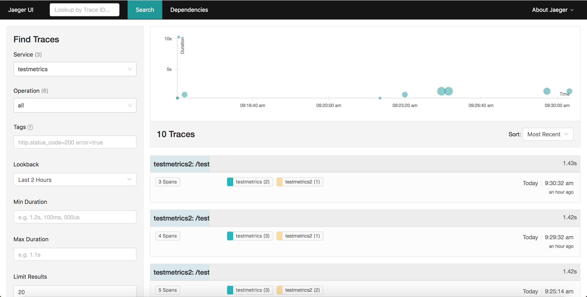

---

copyright:
  years: 2018, 2019
lastupdated: "2019-06-12"

keywords: how to trace go apps, tracing go, jaeger go, opentracing go, jaeger packages, debug go app, troubleshoot go, go app help

subcollection: go

---

{:new_window: target="_blank"}
{:shortdesc: .shortdesc}
{:screen: .screen}
{:codeblock: .codeblock}
{:pre: .pre}
{:tip: .tip}

# Configuración del rastreo en apps Go
{: #go-e2e-tracing}

La guía de aprendizaje siguiente se centra en los paquetes OpenTracing y Jaeger para el rastreo de aplicaciones Go. Para obtener más información sobre cómo utilizar Jaeger, consulte el [portal de documentación de Jaeger](https://www.jaegertracing.io/docs/1.11/){: new_window} .

En los pasos siguientes, se utilizan dos pequeñas aplicaciones (una frontal y una de fondo) para rastrear entre dos puntos finales utilizando el módulo Jaeger. Puede empezar de cero o aplicar los principios que se describen aquí en las aplicaciones Go existentes.

## Paso 1. Instalación y habilitación de los paquetes OpenTracing y Jaeger
{: #install-go-opentracing}

1. En la misma ubicación que el archivo `Gopkg.toml` de la aplicación Go, escriba los siguientes mandatos para añadir los paquetes necesarios a la lista de dependencias:
  ```go
  dep ensure -add "github.com/opentracing/opentracing-go"
  dep ensure -add "github.com/uber/jaeger-client-go"
  dep ensure -add "github.com/uber/jaeger-lib/metrics/prometheus"
  ```
  {: codeblock}

2. Añada las siguientes líneas al código del servidor Go:
  ```go
  import(
  "github.com/opentracing/opentracing-go"
	"github.com/opentracing/opentracing-go/ext"
	"github.com/uber/jaeger-client-go"
	jaegerprom "github.com/uber/jaeger-lib/metrics/prometheus"
  )
  ```
  {: codeblock}

### Adición del rastreo a la aplicación de servidor
{: #add-tracing-go}

Son necesarias unas sentencias para añadir el rastreo a la aplicación de servidor. Primero, debe crear un rastreador.

Para crear un rastreador, proporcione los siguientes elementos:
 * Transportador
 * Reporter
 * Exportador de métricas opcional
 
En esta guía de aprendizaje, Jaeger exporta métricas de estilo Prometheus. Un objeto de métricas permite a Jaeger informar sobre las métricas a Prometheus.

1. Para crear un objeto de métricas, añada las sentencias siguientes a la función principal:
  ```go
  factory := jaegerprom.New()
  metrics := jaeger.NewMetrics(factory, map[string]string{"lib": "jaeger"})
  ```
  {: codeblock}

2. Proporcione la sentencia siguiente para un transportador, que indica a Jaeger dónde debe enviar los rastreos. Para el desarrollo local, el destino es `localhost` en el puerto `5775`. Aunque el nombre de host puede cambiar, en la mayoría de los casos el puerto es `5775`.
  ```go
  transport, err := jaeger.NewUDPTransport("<hostname>:<port>", 0)
  if err != nil {
	log.Errorln(err.Error())
  }
  ```
  {: codeblock}

3. Un creador de informes informa a Jaeger sobre cómo reporta los datos de rastreo. Se utilizan tres tipos de creadores de informes:
  * Registro - imprime datos de distribución como registro
  * Remoto - envía datos de distribución a un agente de Jaeger
  * Compuesto - combina más de un creador de informes

  Puesto que los kits de inicio de Go utilizan Logrus para registrar datos, no es posible notificar distribuciones de Jaeger de forma predeterminada. Sin embargo, Jaeger da soporte a una interfaz de registro que se puede utilizar añadiendo un adaptador de registro con la siguiente sentencia:
  ```go
  type LogrusAdapter struct{}

  func (l LogrusAdapter) Error(msg string) {
	log.Errorf(msg)
  }

  func (l LogrusAdapter) Infof(msg string, args ...interface{}) {
	log.Infof(msg, args)
  }
  ```
  {: codeblock}

4. Para crear un creador de informes que abarque distribuciones de registros e informes, añada las sentencias siguientes:
  ```go
  logAdapt := LogrusAdapter{}
  reporter := jaeger.NewCompositeReporter(
	jaeger.NewLoggingReporter(logAdapt),
	jaeger.NewRemoteReporter(transport,
		jaeger.ReporterOptions.Metrics(metrics),
		jaeger.ReporterOptions.Logger(logAdapt),
	),
  )
  defer reporter.Close()
  ```
  {: codeblock}

5. Un objeto de muestra determina en qué situaciones o con qué frecuencia se notifican las distribuciones. A efecto de desarrollo, una aplicación informa sobre todas las distribuciones que recibe. Sin embargo, para la producción, es posible que no se puedan producir informes de todas las distribuciones. Para informar acerca de todas las distribuciones, puede utilizar el objeto ConstSampler:
  ```go
  sampler := jaeger.NewConstSampler(true)
  ```
  {: codeblock}

6. Ahora que ha creado el creador de informes, el manejador de ejemplos y los objetos de métrica, puede crear un rastreador.
  ```go
  tracer, closer := jaeger.NewTracer("<application name>",
	sampler,
	reporter,
	jaeger.TracerOptions.Metrics(metrics),
  )
  defer closer.Close()

  opentracing.SetGlobalTracer(tracer)
  ```
  {: codeblock}

7. Añada una función de middleware que extraiga datos de distribución de una solicitud de cliente o cree un nuevo objeto de distribución de raíz:
  ```go
  func OpenTracing() gin.HandlerFunc {
	return func(c *gin.Context) {
		wireCtx, _ := opentracing.GlobalTracer().Extract(
			opentracing.HTTPHeaders,
			opentracing.HTTPHeadersCarrier(c.Request.Header))

		serverSpan := opentracing.StartSpan(c.Request.URL.Path,
			ext.RPCServerOption(wireCtx))
		defer serverSpan.Finish()
		c.Request = c.Request.WithContext(opentracing.ContextWithSpan(c.Request.Context(), serverSpan))
		c.Next()
	}
  }
  ```
  {: codeblock}

8. Añada el middleware al direccionador. **DEBE** añadir esta sentencia antes de que se creen los puntos finales:
  ```go
  router.Use(OpenTracing)
  ...
  router.GET("/health", routes.HealthGET)
  ```
  {: codeblock}

  Esta sentencia configura una aplicación que puede extraer una distribución e informar sobre los nuevos datos de distribución. Todos los kits de inicio de Go implementan al completo el OpenTracing del lado del servidor de forma predeterminada.

9. Para enviar datos de span de un servicio a otro, debe añadir algunas sentencias más. Consulte la solicitud de ejemplo siguiente:
  ```go
  client := http.Client{}
  req, _ := http.NewRequest("GET", "http://localhost:3000", nil)
  client.Do(req)
  ```
  {: codeblock}

10. Para enviar datos de distribución junto con esta solicitud, añada dos sentencias una vez se haya creado la solicitud:
  ```go
  client := http.Client{}
  req, _ := http.NewRequest("GET", "http://localhost:3000", nil)

  span := opentracing.SpanFromContext(c.Request.Context())
  opentracing.GlobalTracer().Inject(span.Context(), opentracing.HTTPHeaders, opentracing.HTTPHeadersCarrier(req.Header))

  client.Do(req)
  ```
  {: codeblock}

## Paso 2. Configuración de un servidor Jaeger local
{: #setup-jaeger-server}

Los servidores Jaeger están formados por tres servicios independientes:
 * Agentes
 * Recopiladores
 * Consultas
 
Los servicios de Go se conectan con el agente mediante el objeto `UDPTransport`. A continuación, los agentes envían informes de datos a los recopiladores, que almacenan los datos de distribución en la base de datos. Después, el servicio de consulta permitirá al usuario recuperar las distribuciones en la base de datos. Los servicios están separados para más flexibilidad, puesto que todos los servicios deben tener sus propios agentes a los que conectarse, mientras que los servicios de consulta y recopilador se pueden escalar en función de la necesidad.

Sin embargo, para el desarrollo local, Jaeger proporciona un servicio integral, que se suministra con el agente, el recopilador, la base de datos y los servicios de consulta empaquetados juntos. Esta configuración es útil para el desarrollo local, pero no la utilice en producción.

Antes de realizar el despliegue de la app en cualquier nube, puede probar la configuración de rastreo localmente.

Para obtener más información sobre el despliegue de Jaeger en un contenedor utilizando Kubernetes, consulte [estos pasos](#jaeger-kube).

Para ejecutar el servicio todo en uno de forma local, ejecute el mandato siguiente:
```bash
docker run -d --name jaeger \
  -e COLLECTOR_ZIPKIN_HTTP_PORT=9411 \
  -p 5775:5775/udp \
  -p 6831:6831/udp \
  -p 6832:6832/udp \
  -p 5778:5778 \
  -p 16686:16686 \
  -p 14268:14268 \
  -p 9411:9411 \
  jaegertracing/all-in-one:latest
 ```
{: codeblock}

El agente se puede conectar en el puerto `5775`, mientras que la consulta se puede conectar en el puerto `16686`.

### Configuración de un servidor Jaeger desplegado en Kubernetes
{: #jaeger-kube}

De la misma forma que el desarrollo local, Jaeger proporciona un servicio todo en uno para el desarrollo de Kubernetes. Utilice el servicio todo en uno para el desarrollo en lugar del código de producción. Para obtener más información sobre cómo desplegar Kubernetes en producción, consulte la [guía de plantillas de Kubernetes de Jaeger](https://github.com/jaegertracing/jaeger-kubernetes#production-setup){: new_window} .

Para desplegar el servidor de Jaeger, siga estos pasos:
1. Asegúrese de que el clúster está configurado ejecutando `ibmcloud cs cluster-config <cluster name>` y siga las instrucciones.
2. Ejecute el mandato siguiente:
  ```go
  kubectl create -f https://raw.githubusercontent.com/jaegertracing/jaeger-kubernetes/master/all-in-one/jaeger-all-in-one-template.yml
  ```
  {: codeblock}

  Este mandato despliega un agente de Jaeger, un recopilador y una consulta en el clúster de Kubernetes.
3. Antes de desplegar la aplicación Go en Kubernetes, debe actualizar el transporte UDP para que apunte correctamente al agente de Jaeger. El mandato `kubectl` del paso anterior crea un punto final interno denominado `"jaeger-agent:5775"`. Actualice el transporte con este nuevo punto final.
  ```go
  transport, err := jaeger.NewUDPTransport("jaeger-agent:5775", 0)
  ```
  {: codeblock}

4. Una vez que se haya desplegado la aplicación, podrá visualizar los datos de rastreo si va a <*public cluster ip*>:<*port*>. Para saber la dirección IP pública del clúster, ejecute `bx cs workers <*cluster name*>`.
Podrá encontrar el puerto ejecutando `kubectl get service jaeger-query`.

## Paso 3. Prueba de un caso de ejemplo
{: #test-go-tracing}

Si sigue los pasos anteriores, es sencillo crear dos aplicaciones Go independientes que ofrezcan soporte al rastreo. Puede añadir una ruta a uno de los proyectos con el código siguiente:
```go
client := http.Client{}
req, _ := http.NewRequest("GET", "http://localhost:<other port>", nil)

span := opentracing.SpanFromContext(c.Request.Context())
opentracing.GlobalTracer().Inject(span.Context(), opentracing.HTTPHeaders, opentracing.HTTPHeadersCarrier(req.Header))

client.Do(req)
```
{: codeblock}

Esta ruta envía una solicitud `GET` de una aplicación a otra.

Para ver las distribuciones, vaya a `http://localhost:16686`. Puede buscar rastreos por servicio, operación y etiquetas y, a continuación, pulsar en **Buscar rastreos**.



Pulse en un rastreo específico para ver más información sobre el mismo: 
