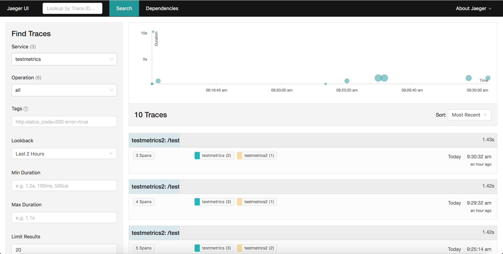
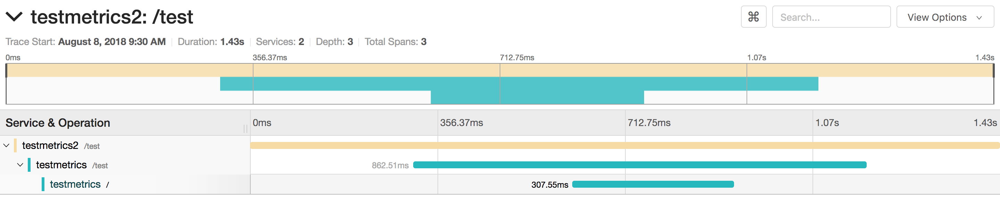

---

copyright:
  years: 2018, 2019
lastupdated: "2019-04-04"

keywords: how to trace go apps, tracing go, jaeger go, opentracing go, jaeger packages, debug go app, troubleshoot go, go app help

subcollection: go

---

{:new_window: target="_blank"}
{:shortdesc: .shortdesc}
{:screen: .screen}
{:codeblock: .codeblock}
{:pre: .pre}
{:tip: .tip}

# Go アプリでのトレースのセットアップ
{: #go-e2e-tracing}

以下のチュートリアルでは、Go アプリケーションをトレースするための Opentracing および Jaeger のパッケージを中心に説明します。 Jaeger の使用について詳しくは、[Jaeger 資料ポータル](https://www.jaegertracing.io/docs/1.11/){: new_window} を参照してください。

以下のステップでは、2 つの小さなアプリケーション (1 つはフロントエンド、もう 1 つはバックエンド) を使用して、2 つのエンドポイント間で Jaeger モジュールを使用したトレースが行われます。 最初から開始することも、既存の Go アプリケーションにここで説明する原則を適用することもできます。

## ステップ 1. Opentracing および Jaeger パッケージのインストールと有効化
{: #install-go-opentracing}

1. Go アプリケーションの `Gopkg.toml` ファイルと同じ場所で、以下のコマンドを入力して、必要なパッケージを依存関係リストに追加します。
  ```go
  dep ensure -add "github.com/opentracing/opentracing-go"
  dep ensure -add "github.com/uber/jaeger-client-go"
  dep ensure -add "github.com/uber/jaeger-lib/metrics/prometheus"
  ```
  {: codeblock}

2. Go サーバー・コードに以下の行を追加します。
  ```go
  import(
  "github.com/opentracing/opentracing-go"
	"github.com/opentracing/opentracing-go/ext"
	"github.com/uber/jaeger-client-go"
	jaegerprom "github.com/uber/jaeger-lib/metrics/prometheus"
  )
  ```
  {: codeblock}

### サーバー・アプリケーションへのトレースの追加
{: #add-tracing-go}

サーバー・アプリケーションにトレースを追加するには、いくつかのステートメントが必要です。 まず、トレーサーを作成する必要があります。

トレーサーを作成するには、以下を指定します。
 * トランスポーター
 * レポーター
 * オプションのメトリック・エクスポーター
 
このチュートリアルでは、Jaeger が Prometheus スタイルのメトリックをエクスポートします。 メトリック・オブジェクトを使用すると、Jaeger がメトリックを Prometheus に報告できるようになります。

1. メトリック・オブジェクトを作成するには、main 関数に以下のステートメントを追加します。
  ```go
  factory := jaegerprom.New()
  metrics := jaeger.NewMetrics(factory, map[string]string{"lib": "jaeger"})
  ```
  {: codeblock}

2. トランスポーターに対して以下のステートメントを指定します。これによって、Jaeger にトレースの送信先を通知します。 ローカル開発の場合、宛先はポート `5775` の `localhost`です。 ホスト名は変更される場合がありますが、ほとんどの場合、ポートは `5775`です。
  ```go
  transport, err := jaeger.NewUDPTransport("<hostname>:<port>", 0)
  if err != nil {
	log.Errorln(err.Error())
  }
  ```
  {: codeblock}

3. レポーターは、Jaeger にトレース・データを報告する方法を通知します。 以下の 3 つのタイプのレポーターが使用されます。
  * ロギング - スパン・データをログとして出力します
  * リモート - スパン・データを Jaeger エージェントに送信します
  * 複合 - 複数のレポーターを結合します

  Go スターター・キットは Logrus を使用してデータをログに記録するため、デフォルトでは Jaeger スパンの報告はできません。 ただし Jaeger は、以下のステートメントでロギング・アダプターを追加することによって使用できる、ロギング・インターフェースをサポートします。
  ```go
  type LogrusAdapter struct{}

  func (l LogrusAdapter) Error(msg string) {
	log.Errorf(msg)
  }

  func (l LogrusAdapter) Infof(msg string, args ...interface{}) {
	log.Infof(msg, args)
  }
  ```
  {: codeblock}

4. スパンをログに記録して報告も行うレポーターを作成するには、以下のステートメントを追加します。
  ```go
  logAdapt := LogrusAdapter{}
  reporter := jaeger.NewCompositeReporter(
	jaeger.NewLoggingReporter(logAdapt),
	jaeger.NewRemoteReporter(transport,
		jaeger.ReporterOptions.Metrics(metrics),
		jaeger.ReporterOptions.Logger(logAdapt),
	),
  )
  defer reporter.Close()
  ```
  {: codeblock}

5. sampler オブジェクトは、スパンを報告するシチュエーションまたは頻度を決定します。 開発目的の場合、アプリケーションは受信するすべてのスパンを報告する必要があります。 しかし実稼働環境では、すべてのスパンの報告が実現可能ではない場合があります。 すべてのスパンを報告するには、ConstSampler オブジェクトを使用できます。
  ```go
  sampler := jaeger.NewConstSampler(true)
  ```
  {: codeblock}

6. reporter オブジェクト、sampler オブジェクト、および metrics オブジェクトを作成したので、トレーサーを作成できます。
  ```go
  tracer, closer := jaeger.NewTracer("<application name>",
	sampler,
	reporter,
	jaeger.TracerOptions.Metrics(metrics),
  )
  defer closer.Close()

  opentracing.SetGlobalTracer(tracer)
  ```
  {: codeblock}

7. クライアント要求からスパン・データを抽出するか、新規ルート・スパン・オブジェクトを作成する、ミドルウェア関数を追加します。
  ```go
  func OpenTracing() gin.HandlerFunc {
	return func(c *gin.Context) {
		wireCtx, _ := opentracing.GlobalTracer().Extract(
			opentracing.HTTPHeaders,
			opentracing.HTTPHeadersCarrier(c.Request.Header))

		serverSpan := opentracing.StartSpan(c.Request.URL.Path,
			ext.RPCServerOption(wireCtx))
		defer serverSpan.Finish()
		c.Request = c.Request.WithContext(opentracing.ContextWithSpan(c.Request.Context(), serverSpan))
		c.Next()
	}
  }
  ```
  {: codeblock}

8. ミドルウェアをルーターに追加します。 エンドポイントを作成する前に、このステートメントを**必ず**追加してください。
  ```go
  router.Use(OpenTracing)
  ...
  router.GET("/health", routes.HealthGET)
  ```
  {: codeblock}

  このステートメントは、スパンを抽出してから新規スパン・データを報告できるアプリケーションをセットアップします。 デフォルトでは、すべての Go スターター・キットがサーバー・サイドの OpenTracing を完全に実装します。

9. あるサービスから別のサービスにスパン・データを送信するには、さらにいくつかのステートメントを追加する必要があります。 以下のサンプル要求を参照してください。
  ```go
  client := http.Client{}
  req, _ := http.NewRequest("GET", "http://localhost:3000", nil)
  client.Do(req)
  ```
  {: codeblock}

10. この要求と共にスパン・データを送信するには、要求の作成後に 2 つのステートメントを追加します。
  ```go
  client := http.Client{}
  req, _ := http.NewRequest("GET", "http://localhost:3000", nil)

  span := opentracing.SpanFromContext(c.Request.Context())
  opentracing.GlobalTracer().Inject(span.Context(), opentracing.HTTPHeaders, opentracing.HTTPHeadersCarrier(req.Header))

  client.Do(req)
  ```
  {: codeblock}

## ステップ 2. ローカル Jaeger サーバーのセットアップ
{: #setup-jaeger-server}

Jaeger サーバーは、以下の 3 つの別個のサービスで構成されています。
 * エージェント
 * コレクター
 * 照会
 
Go サービスは、`UDPTransport` オブジェクトを使用してエージェントに接続します。 次に、エージェントはデータをコレクターに報告し、コレクターはスパン・データをデータベースに保管します。 次に照会サービスは、ユーザーがデータベース内のスパンを取得できるようにします。 すべてのサービスには接続先となる独自のエージェントが必要であり、コレクター・サービスと照会サービスの数は必要に応じてスケーリングできるため、サービスは柔軟性のために分離されています。

しかし、ローカル開発の場合、Jaeger はオールインワン・サービスを提供します。これには、エージェント・サービス、コレクター・サービス、データベース・サービス、および照会サービスが一緒にパッケージ化されています。 この構成は、ローカル開発では役立ちますが、実動では使用しないでください。

アプリをクラウドにデプロイする前に、トレースをローカルでテストすることができます。

Kubernetes を使用して Jaeger をコンテナーにデプロイする方法について詳しくは、[こちらのステップ](#jaeger-kube)を参照してください。

オールインワン・サービスをローカルで実行するには、以下のコマンドを実行します。
```bash
docker run -d --name jaeger \
  -e COLLECTOR_ZIPKIN_HTTP_PORT=9411 \
  -p 5775:5775/udp \
  -p 6831:6831/udp \
  -p 6832:6832/udp \
  -p 5778:5778 \
  -p 16686:16686 \
  -p 14268:14268 \
  -p 9411:9411 \
  jaegertracing/all-in-one:latest
 ```
{: codeblock}

エージェントはポート `5775` で接続できます。照会はポート `16686` に接続できます。

### Kubernetes にデプロイした Jaeger サーバーのセットアップ
{: #jaeger-kube}

ローカル開発と同様に、Jaeger は Kubernetes 開発用のオールインワン・サービスを提供します。 オールインワン・サービスは開発用のみに使用し、実動コードには使用しないでください。 実動用に Kubernetes にデプロイする方法について詳しくは、[Jaeger Kubernetes テンプレート・ガイド](https://github.com/jaegertracing/jaeger-kubernetes#production-setup){: new_window}  を参照してください。

Jaeger サーバーをデプロイするには、以下の手順を実行します。
1. クラスターは必ず `ibmcloud cs cluster-config <cluster name>` を実行してセットアップし、説明に従ってください。
2. 次のコマンドを実行します。
  ```go
  kubectl create -f https://raw.githubusercontent.com/jaegertracing/jaeger-kubernetes/master/all-in-one/jaeger-all-in-one-template.yml
  ```
  {: codeblock}

  このコマンドは、Jaeger エージェント、コレクター、および照会を Kubernetes クラスターにデプロイします。
3. Go アプリケーションを Kubernetes にデプロイする前に、Jaeger エージェントを正しく指すように UDP トランスポートを更新する必要があります。 前のステップの `kubectl` コマンドにより、`"jaeger-agent:5775"` という名前の内部エンドポイントが作成されます。 この新規エンドポイントでトランスポートを更新します。
  ```go
  transport, err := jaeger.NewUDPTransport("jaeger-agent:5775", 0)
  ```
  {: codeblock}

4. アプリケーションがデプロイされた後、<*public cluster ip*>:<*port*> に移動して、トレース・データを表示できます。 `bx cs workers <*cluster name*>` を実行すると、パブリック・クラスター IP アドレスを検出できます。
`kubectl get service jaeger-query` を実行すると、ポートを検出できます。

## ステップ 3. シナリオ例のテスト
{: #test-go-tracing}

前のステップを実行すると、トレースをサポートする 2 つの別個の Go アプリケーションを簡単に作成できます。 以下のコードを使用して、いずれかのプロジェクトに経路を追加できます。
```go
client := http.Client{}
req, _ := http.NewRequest("GET", "http://localhost:<other port>", nil)

span := opentracing.SpanFromContext(c.Request.Context())
opentracing.GlobalTracer().Inject(span.Context(), opentracing.HTTPHeaders, opentracing.HTTPHeadersCarrier(req.Header))

client.Do(req)
```
{: codeblock}

この経路により、1 つのアプリケーションから別のアプリケーションに `GET` 要求が送信されます。

スパンを表示するには、`http://localhost:16686` に移動します。 トレースを検索するには、サービス、操作、およびタグを入力して**「トレースの検索 (Find Traces)」**をクリックします。



特定のトレースをクリックすると、その詳細情報が表示されます。

