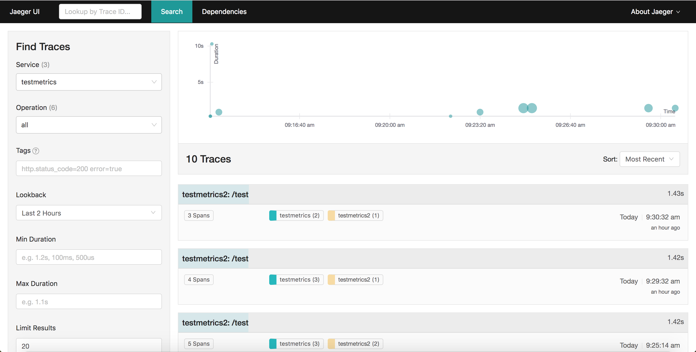
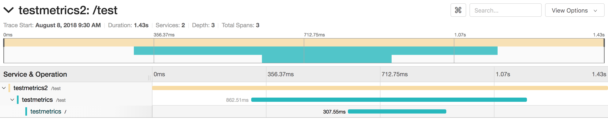

---

copyright:
  years: 2018, 2019
lastupdated: "2019-06-10"

keywords: how to trace go apps, tracing go, jaeger go, opentracing go, jaeger packages, debug go app, troubleshoot go, go app help

subcollection: go

---

{:new_window: target="_blank"}
{:shortdesc: .shortdesc}
{:screen: .screen}
{:codeblock: .codeblock}
{:pre: .pre}
{:tip: .tip}

# Setting up tracing in Go apps
{: #go-e2e-tracing}

The following tutorial focuses on OpenTracing and Jaeger packages for tracing Go applications. For more information about using Jaeger, see the [Jaeger documentation portal](https://www.jaegertracing.io/docs/1.11/){: new_window} .

In the following steps, two small applications (one front-end, one back-end) are used to trace between two endpoints by using the Jaeger module. You can start from scratch or apply the principles that are described here to your existing Go applications.

## Step 1. Installing and enabling the OpenTracing and Jaeger packages
{: #install-go-opentracing}

1. In the same location as your Go application’s `Gopkg.toml` file, enter the following commands to add the required packages into your dependency list:
  ```go
  dep ensure -add "github.com/opentracing/opentracing-go"
  dep ensure -add "github.com/uber/jaeger-client-go"
  dep ensure -add "github.com/uber/jaeger-lib/metrics/prometheus"
  ```
  {: codeblock}

2. Add the following lines to your Go server code:
  ```go
  import(
  "github.com/opentracing/opentracing-go"
	"github.com/opentracing/opentracing-go/ext"
	"github.com/uber/jaeger-client-go"
	jaegerprom "github.com/uber/jaeger-lib/metrics/prometheus"
  )
  ```
  {: codeblock}

### Adding tracing to your server application
{: #add-tracing-go}

A few statements are needed to add tracing to your server application. First, you must create a tracer.

To create a tracer, supply the following items:
 * Transporter
 * Reporter
 * Optional metrics exporter
 
In this tutorial, Jaeger exports Prometheus-style metrics. A metrics object allows Jaeger to report metrics to Prometheus.

1. To create a metrics object, add the following statements to the main function:
  ```go
  factory := jaegerprom.New()
  metrics := jaeger.NewMetrics(factory, map[string]string{"lib": "jaeger"})
  ```
  {: codeblock}

2. Supply the following statement for a transporter, which tells Jaeger where to send its traces. For local development, the destination is `localhost` at port `5775`. While the host name might change, the port in most cases is `5775`.
  ```go
  transport, err := jaeger.NewUDPTransport("<hostname>:<port>", 0)
  if err != nil {
	log.Errorln(err.Error())
  }
  ```
  {: codeblock}

3. A reporter tells Jaeger how it reports its tracing data. Three types of reporters are used:
  * Logging - prints span data as a log
  * Remote - sends span data to a Jaeger agent
  * Composite - combines more than one reporter

  Because Go starter kits use Logrus to log data, reporting Jaeger spans isn't possible by default. However, Jaeger supports a logging interface that can be used by adding a logging adapter with the following statement:
  ```go
  type LogrusAdapter struct{}

  func (l LogrusAdapter) Error(msg string) {
	log.Errorf(msg)
  }

  func (l LogrusAdapter) Infof(msg string, args ...interface{}) {
	log.Infof(msg, args)
  }
  ```
  {: codeblock}

4. To create a reporter that both logs and reports spans, add the following statements:
  ```go
  logAdapt := LogrusAdapter{}
  reporter := jaeger.NewCompositeReporter(
	jaeger.NewLoggingReporter(logAdapt),
	jaeger.NewRemoteReporter(transport,
		jaeger.ReporterOptions.Metrics(metrics),
		jaeger.ReporterOptions.Logger(logAdapt),
	),
  )
  defer reporter.Close()
  ```
  {: codeblock}

5. A sampler object determines in which situations or how often spans are reported. For development purposes, an application reports all spans that it receives. However, for production, reporting all the spans might not be feasible. To report all spans, you can use the ConstSampler object:
  ```go
  sampler := jaeger.NewConstSampler(true)
  ```
  {: codeblock}

6. Now that you created the reporter, sampler, and metrics objects, you can create a tracer.
  ```go
  tracer, closer := jaeger.NewTracer("<application name>",
	sampler,
	reporter,
	jaeger.TracerOptions.Metrics(metrics),
  )
  defer closer.Close()

  opentracing.SetGlobalTracer(tracer)
  ```
  {: codeblock}

7. Add a middleware function that either extracts span data from a client request, or creates a new root span object:
  ```go
  func OpenTracing() gin.HandlerFunc {
	return func(c *gin.Context) {
		wireCtx, _ := opentracing.GlobalTracer().Extract(
			opentracing.HTTPHeaders,
			opentracing.HTTPHeadersCarrier(c.Request.Header))

		serverSpan := opentracing.StartSpan(c.Request.URL.Path,
			ext.RPCServerOption(wireCtx))
		defer serverSpan.Finish()
		c.Request = c.Request.WithContext(opentracing.ContextWithSpan(c.Request.Context(), serverSpan))
		c.Next()
	}
  }
  ```
  {: codeblock}

8. Add the middleware to the router. You **MUST** add this statement before the endpoints are created:
  ```go
  router.Use(OpenTracing)
  ...
  router.GET("/health", routes.HealthGET)
  ```
  {: codeblock}

  This statement sets up an application that can extract a span and then report new span data. By default, all Go starter kits fully implement server-side OpenTracing.

9. To send the span data from one service to another, you must add a few more statements. See the following sample request:
  ```go
  client := http.Client{}
  req, _ := http.NewRequest("GET", "http://localhost:3000", nil)
  client.Do(req)
  ```
  {: codeblock}

10. To send span data along with this request, add two statements after the request is created:
  ```go
  client := http.Client{}
  req, _ := http.NewRequest("GET", "http://localhost:3000", nil)

  span := opentracing.SpanFromContext(c.Request.Context())
  opentracing.GlobalTracer().Inject(span.Context(), opentracing.HTTPHeaders, opentracing.HTTPHeadersCarrier(req.Header))

  client.Do(req)
  ```
  {: codeblock}

## Step 2. Setting up a local Jaeger server
{: #setup-jaeger-server}

Jaeger servers are made up of three separate services:
 * Agents
 * Collectors
 * Queries
 
Go services connect to the agent by using `UDPTransport` object. Agents then report data to collectors, which store span data into a database. The query service then allows the user to retrieve spans in the database. The services are separated for flexibility because all services must have their own agents to connect to, while the number of collector and query services can be scaled based on need.

However, for local development, Jaeger provides an all-in-one service, which comes with the agent, collector, database, and query services packaged together. This configuration is useful for local development, but don't use it in production.

Before you deploy your app to any cloud, you can test the tracing locally.

For more information about deploying Jaeger in a container by using Kubernetes, see [these steps](#jaeger-kube).

To run the all-in-one service locally, run the following command:
```bash
docker run -d --name jaeger \
  -e COLLECTOR_ZIPKIN_HTTP_PORT=9411 \
  -p 5775:5775/udp \
  -p 6831:6831/udp \
  -p 6832:6832/udp \
  -p 5778:5778 \
  -p 16686:16686 \
  -p 14268:14268 \
  -p 9411:9411 \
  jaegertracing/all-in-one:latest
 ```
{: codeblock}

The agent can be connected on port `5775`, while the query can be connected to port `16686`.

### Setting up a deployed Jaeger server to Kubernetes
{: #jaeger-kube}

Like local development, Jaeger provides an all-in-one service for Kubernetes development. Use the all-in-one service only for development, not production code. To learn more about deploying to Kubernetes for production, see the [Jaeger Kubernetes Templates guide](https://github.com/jaegertracing/jaeger-kubernetes#production-setup){: new_window} .

To deploy the Jaeger server, complete these steps:
1. Make sure that your cluster is set up by running `ibmcloud cs cluster-config <cluster name>`, and follow the instructions.
2. Run the following command:
  ```go
  kubectl create -f https://raw.githubusercontent.com/jaegertracing/jaeger-kubernetes/master/all-in-one/jaeger-all-in-one-template.yml
  ```
  {: codeblock}

  This command deploys a Jaeger agent, collector, and query to your Kubernetes cluster.
3. Before you deploy the Go application to Kubernetes, you must update the UDP Transport to correctly point to the Jaeger agent. The `kubectl` command in the previous step creates an internal endpoint named `"jaeger-agent:5775"`. Update the transport with this new endpoint.
  ```go
  transport, err := jaeger.NewUDPTransport("jaeger-agent:5775", 0)
  ```
  {: codeblock}

4. After the application is deployed, you can view the tracing data by going to <*public cluster ip*>:<*port*>. You can find the public cluster IP address by running `bx cs workers <*cluster name*>`.
You can find the port by running `kubectl get service jaeger-query`.

## Step 3. Testing an example scenario
{: #test-go-tracing}

When you follow the previous steps, it's simple to create two separate Go applications that support tracing. You can add a route to one of the projects with the following code:
```go
client := http.Client{}
req, _ := http.NewRequest("GET", "http://localhost:<other port>", nil)

span := opentracing.SpanFromContext(c.Request.Context())
opentracing.GlobalTracer().Inject(span.Context(), opentracing.HTTPHeaders, opentracing.HTTPHeadersCarrier(req.Header))

client.Do(req)
```
{: codeblock}

This route sends a `GET` request from one application to another.

To view spans, go to `http://localhost:16686`. You can search traces by service, operation, and tags, and then click **Find Traces**.



Click a specific trace to view more information about it:
